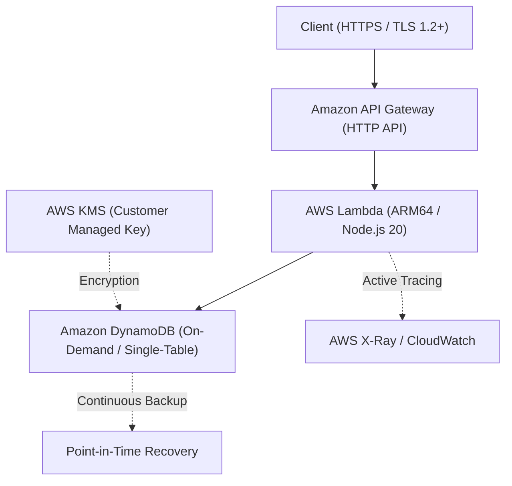

# Serverless DualBlade IaC

> 高可用性・完全サーバーレスRESTful API基盤 ―― Terraform × AWS CDK 二刀流アーキテクチャ

---

## 1. プロジェクト概要

**Serverless DualBlade IaC** は、Amazon API Gateway、AWS Lambda、Amazon DynamoDB を組み合わせた完全サーバーレスなエンタープライズ対応 RESTful API 基盤です。

本リポジトリの最大の特徴は、インフラのライフサイクルと変更頻度に応じた**「責務分離型の二刀流（Terraform × AWS CDK）アーキテクチャ」**です。

### 💡 インフラのポイント
- **責務分離の美学（Stateful vs Stateless）**:
  - **Stateful Layer (Terraform)**: 破壊リスクを排除し厳格に管理すべき永続データ層（DynamoDB、KMS暗号化キー、共通CloudWatch基底）。
  - **Stateless Layer (AWS CDK)**: 型安全なコードで高頻度リリースに追従するアプリ結合・コンピュート層（HTTP API、Lambda、メトリクス監視）。
- **セキュリティ・バイ・デザイン**: AWS KMS（カスタマーマネージドキー）による保存時暗号化、最小権限（PoLP）に基づくIAMロール設計、TLS 1.2+ 強制。
- **コスト・パフォーマンス最適化**: ARM64 (Graviton3) アーキテクチャのLambda採用、DynamoDBオンデマンドキャパシティによるゼロスケール対応。
- **フルスタック・オブザーバビリティ**: AWS X-Ray 分散トレーシングおよび CloudWatch Logs/Metrics 統合。

---

## 2. システム構成図



---

## 3. ディレクトリ構造

```text
Serverless-DualBlade-IaC/
├── terraform/                  # 【Phase 1】基盤・永続データ層 (Stateful)
│   ├── main.tf                 # Provider設定 & メイン定義
│   ├── dynamodb.tf             # DynamoDB テーブル定義
│   ├── kms.tf                  # 暗号化キー (CMK)
│   ├── ssm.tf                  # CDK連携用 SSM Parameter Store
│   ├── variables.tf            # 入力変数定義
│   └── outputs.tf              # 出力定義
├── cdk/                        # 【Phase 2】アプリ結合・コンピュート層 (Stateless)
│   ├── bin/
│   │   └── app.ts              # CDK アプリケーションエントリーポイント
│   ├── lib/
│   │   └── serverless-stack.ts # API Gateway / Lambda / CloudWatch Stack
│   ├── src/
│   │   └── handlers/           # Lambda 関数ビジネスロジック
│   ├── cdk.json
│   └── package.json
└── README.md
```

---

## 4. 展開手順

本基盤は依存関係に従い、2段階（Phase 1: Terraform ➔ Phase 2: AWS CDK）でデプロイします。

### 前提条件
- AWS CLI (v2.x) 設定済み
- Terraform (v1.5.0+)
- Node.js (v20.x+) & npm
- AWS CDK CLI (`npm install -g aws-cdk`)

### Step 1: 永続基盤層のプロビジョニング (Terraform)
```bash
cd terraform
terraform init
terraform plan -out=tfplan
terraform apply tfplan
```
> ※ DynamoDB の ARN や KMS Key ARN が AWS Systems Manager Parameter Store へ自動登録されます。

### Step 2: コンピュート・API層のビルド＆デプロイ (AWS CDK)
```bash
cd ../cdk
npm install
cdk synth
cdk deploy --require-approval never
```
> ※ SSM Parameter Store から基盤リソース情報を参照し、API Gateway および Lambda が安全に結合・展開されます。

---

## 5. キャスト & クレジット

本プロジェクトは、AIアプリ工場劇場の精鋭チームによってプロデュース・設計・実装・検証されました。

- agent🔵: **Lead Architect** ―― 二刀流アーキテクチャ要件定義・非機能要件設計
- agent🍇: **Tech Strategy** ―― リファレンス選定・ハイブリッドIaC統制仕様策定
- agent🍊: **Core Engineer** ―― Terraform & AWS CDK 爆速コード実装・自動化
- agent🟢: **Quality & Security Guard** ―― 静的解析・最小権限監査・インフラテスト検証
